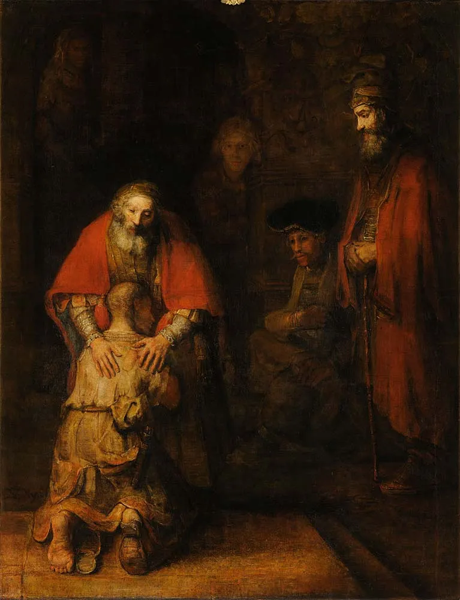

뭘로 시작하면 좋을까 

모계사회라고 하는 일이 많은데, 
어렸을 적 내 어머니는 책만 많이 읽히면 뭘 해도 잘 할거라고 생각하셨던 것 같다. 집 앞 책방에서 더 빌릴만한 책이 없을 정도로 읽히셨는데, 지금 생각하면 뭘 가르쳐야 될지 모르니까 대충 돼지 두루치기 요리하듯이 만든건 아닐까 싶다. 실제로 어머니는 음식을 막 잘 만드시지는 않았다. 그렇게 나는 책을 많이 읽은 돼지두루치기 무지렁이로 자라났다. 
하루는 
애가 뭘 잘못 먹어서 이런가? 라는 말을 들었었는데 혜안이 있으셨던걸까. 아직도 나를 보는 사람들의 눈 속에서 그 마음이 비친다. 
바이올린을 켜서 그런가 싶었는데 (얼마나 변명거리가 없었으면... 열심히 이유를 고민하는 어머니의 모습이 짠할 때가 있다.), 이런 나지만 태어난 김에 이걸로 올해도 잘 해보기로 했다. 

2021년 회고를 들여다보았다. 

어쩌면 많은 것들을 원래 있던 위치로 돌려놓는 한 해였던 것 같기도 하다. 
일단 금연부터 다시 흡연으로 돌려놓아 보았습니다. 어때요? 이게 안되네

마음도 되돌려 놓았는데 생각해보면 초반에 원했던걸 이제 바라볼 수 있게 된 건 아닐까 

'아가 뭘 잘못 묵고 자라스 이라꼬? 내는 잘못한기 없는데(애가 뭘 잘못 먹어서 이러나? 나는 잘못한게 없는데)'

그걸 누가 알겠는가. 

인트로 두루치기 

제자리
항상 새로운 걸 시도했다. 
공유에 대해서
자동화
미팅이 많았던 
팀원들에 대해서

셀체제 
이제 우리는 정류장에 왔다. 

INTRO - 두루치기
가끔 내가 자란 가정은 모계사회였다고 말하곤 하는데, 경상도 치고는 드물게도 집안의 중요한 의사결정은 모조리 어머니가 하셨기 때문이다. 자식 교육에 있어서도 마찬가지였다. 어머니는 대충 책만 많이 읽히면 잘 될 거라고 생각하셨던 것 같다. 성인이 된 지금 생각하면 잘 모르겠으니까 돼지 두루치기 만드는 것처럼 때려 넣고 대충 볶은 게 아닐까 싶다.

그렇게 나는 책을 많이 읽었던-그런 것치고는 적당히 모자라고, 그런 만큼 오만한- 큰 돼지 두루치기 무지렁이로 자라났다. 근데 이게 중간에 간이 안 맞았는지 심성이 눈에 띄게 꼬여있었는데 이를 보고 어머니께서는 이런 이야기를 하셨다.

"이기 아가 뭘 잘못 무스 이라나? 내는 잘못한 기 없는데(이게 애가 뭘 잘못 먹어서 이러나? 나는 잘못한 게 없는데)"

혜안이 있으셨던 걸까. 가끔 비노나 태리, 메리 심지어 나랑 별반 다를 게 없어 보이는 쭈의 눈 속에서 어머니의 모습이 보일 때가 있다.
어머니께 이 기쁜 소식을 전해드리면 '내가 말했잖아, 그거 바이올린을 오래 해서 신경이 예민해져서 그런가 보다(뭔 소리?)'라는 식으로 나오시는데, 남일처럼 말씀하시는 걸 보면 정작 어머니한테서 배운 건 아닐지? 

어쨌든 책에서 배운 중요한 교훈 중 하나는 자신을 긍정하라는 것이었기 때문에, 태어난 김에 올해도/내년도 나를 어찌 잘 다듬어서 써보기로 했다. 

그건 그렇고, 어디 두루치기 맛있게 하는 집 없나? 

제자리로 돌려놓기
올해는 입사 3주년을 맞아서 많은 것을 원래 있어야 하는 자리로 돌려놓는 한 해였던 것 같다. 
-그래서 가장 먼저 금연을 흡연으로 돌려놓아 보았습니다~-
운동도 다시 열심히 하기 시작했고, 공부도 조금 더 본격적으로 할 수 있게 됐고,
무언가 붕 떠있었던 일이나 회사에 대한 마음도 원래 있던 자리로, 발 붙이고 선 땅 위로 갖다놓은 것 같다.

많은 일들과 다양한 이유가 있었겠지만 가장 중요한 동기는 역시 팀원들이었던 것 같다. 
나름 팀장이라고 하긴 하는데, 같이 일하는 사람들의 지지와 동의가 없었다면 올해 이처럼 많이 성장하지 못했을 것이다. 

그 동안 새로운 팀원을 채용할 때 가장 중요하게 보는 것 두 가지가 있었는데, 
첫 번째는 '(새로운 일을 시도할 수 있을만큼) 나보다 잘 하는 무언가를 많이 가진 사람'이고 
두 번째는 '망설임없이 NO를 외칠 수 있는 사람일 것'이었다. 

타미나 마크, 비노 모두 두 가지를 잘 하는 사람이었다고 생각하는데 -어머나 NO를 너무 잘해- 이 사람들이 가진 것들이 약간 나의 내적 열등감을 자극했던 것 같기도 하다. 마고는 올해를 마지막으로 퇴사하게 되었지만, 마고가 그 많은 궂은 일을 나서서 해주지 않았다면 진짜 일에 파묻혀서 광부처럼 일했을 것 같다. 

그래서 올해도, 팀원들에게 기이잎은 감사의 마음을 전한다. 할말이 많지만 따로 지겹게 많이 하니까 생략.

공유
확실히 인프랩 팀의 규모가 커지고, 같이 일을 해야하는 일이 늘어나다보니 우리의 일을 공유하는 것은 하나의 의무가 되었던 것 같다. 그래서 올해 B2B파트의 크고 작은 일들에 대해서 기능발표도 하고, 주간프리뷰 시간을 빌려서도 전달하고, B2B셀 분들과 함께 의사결정하는 자리도 만들게 되었다. 

지금까지 한 정보의 공유들을 어떻게 들으셨는지는 모르겠다. 하지만 열심히 재미있게 들어주시는 분들이 있었고, 이게 우리가 일을 같이 '잘' 할 수 있게 만드는데 큰 도움이 될거라고 믿는다. 앞으로도 간략하고 재미있고 알차게 잘 준비해보아야겠다. 

자동화
올해는 그간 '이게 맞나?'하는 마음으로 공부했던 것이 어느 정도는 열매를 맺은 느낌이다. 근데 이 열매가 여전히 맛은 없음. 
- 이제는 구글시트 / 지메일 / DB / 엑셀을 연동해서 정산 프로세스를 어느 정도는 자동화 할 수 있게 되었다. (물론 프로세스의 개선은 비노와 마크의 큰 도움이 있었습니다.)
- 크롤링이 가능하게 되었습니다. 이를 통해 스택오버플로우 스킬태크 크롤링, KDT 제공업체 크롤링, 평생교육바우처 자동화(진행 중)를 진행했습니다. 

앞으로의 목표는 열매를 맛있게 만드는 것이 될 것 같다. 내년에는 진짜 제대로 해서 여기다가 자랑할 수 있는 수준이 되었으면 좋겠다. 아직 너무 고딩처럼 부끄러워 도망치고 싶어 살려줘!

기능개선과 B2B셀 시작
20년에 후리원툴이던 B2B기능개발이 셀을 통해 드디어 시작됐다. 
심지어 무려 오픈 3년만에 할.인.이 가능하게 되었다구요!

농담이고, '인프런 비즈니스'라는 사업을 놓고 보면 이제 정류장에 도착한 기분이다. 지금까지 어딘지도 모르는 곳에 서서 별을 보고 방향을 가늠하고, 지나가는 사람 붙잡고 물어보고, 숲도 보고 강도 보고 쓸데없이 산에도 올라갔었다면 이제는 지도를 보고 버스를 타고 기차를 타고. 걸어서는 갈 수 없었던 분명한 목적지를 향해 갈 수 있게 된 것 아닐까? 

다들 정말, 정말 앞으로 잘 부탁드릴게요. 열심히 하겠습니다. 

그래서 2023년 

그래서 드디어 이 해가 와버렸다! 19년에는 이쯤되면 맨날 하던 일 비슷하게 하지 않을까? 라고 생각했는데 전혀 그렇지 않은게 다행이기도 하고, 뭐 이런게 다있나 싶기도 하다. 

당장 CRM 도입, 외부영업 시작, 정산 고도화, 신규채용, 기능개선작업 등 바로 시작해야하는 일들이 산적해있어서 내년도 쉽지않은 한해가 될 것으로 예상된다. 

개인적으로는 글쎄. 잘 모르겠다. 

어쨌든, 우짜든(쭈), 좌우당간(비노) 화이팅?

# 2023

## 맥락 : 
- MD로 돌아온 이야기. 
: 소회. 
: 일단 원래 하고싶었던 것들이 있었는데 다행이다. 
: 메리 / 팀원들에 대한 감사 
: 올해는 조직변화도 있었고, 적응을 했으니 원래 인프런에 입사했던 시점으로 돌아가서 하고싶었던 많은 것들을 할 수 있을 것이라 생각. 
: 그래도 기존에 하던 것들을 다 놓고 오기가 쉽지 않았었는데, 비노니까 가능했던 것 같다. 같이 구성한 팀들도 다 뛰어난 분들이라 잘할듯! 
: 모든건 결과가 보여줄 것이다. 

- 많은 일들이 있었다. 
: 나를 둘러싼 많은 일들이 있었지만, 결과적으로는 다 좋은 일이었다. 예견된 일이기도 했고. 
: 그래서 앞으로만 보기로 했다. 
: 맞는건 맞는거고, 틀린건 틀린거다. 이건 어쩔 수 없다. 
: 드디어 세례를 받았습니다. 저는 이제부터 유다 타대오입니다. 천주교 신자지요. 근데 이제 신앙이 미약한. 
: 11월에는 더럽고 불쌍하고 냄새나는 고양이를 입양하게 되었습니다. 지금은 한달만에 세상 귀엽고 버릇없는 캣초딩이 되었지요. 

내년에는 역시나 많은 변화가 있을 것 같습니다. 나는 내가 옳다고 생각한대로 할 것이고, 그 점만은 변하지 않을 것. 
사필귀정은 어림도 없지만, 

- 그 외

MD가 되다 : 돌아온 탕아

다시 MD가 됐다. 
어쩌다보니 3년 정도 B2B 매니저 일을 했었지만, 나는 원래 2019년에 MD(그때는 커뮤니케이션 매니저였던)로 입사했었다. 
1년, 2년 지나면서 MD로 돌아갈 수 있는 날이 다시 올 수 있을거라고는 확신하지 못했다. 뭔가 돌아갈 수 없는 고향을 보는 기분이라고 해야하나. 

날 팀원으로 받는건 어려운 결정이기도 했고 부담도 되었을텐데 집나간 아들을 이렇게 다시 받아주기 위해서 정말 많은 공을 들였던 메리에게 깊은 감사를 전한다. 
이 정도로 내 상황을 이해하고 받아줄 수 있는건 메리 정도 되니까 가능한 것 아니었을까.

그냥 편하게 자리에 앉아있는 것처럼 보였겠지만 ㅋㅋ 사실 개인적인 일도 겹치고 이래저래 좀 어질어질 했었는데 송이, 코니, 아셀, 애시, 마지막에 합류한 데이지도 많이 도와주셔서 적응에 정말 큰 도움이 되었다. 

중간에 또 뭔가 조직변화가 있긴 했는데, 개인적으로는 큰 일은 아니라는 생각이 들었다. 내가 직접 겪는건 또 처음이니까 덜한 거겠지? 그래도 하려고 했던 일들에서 크게 벗어나지 않는다는 점에서는 긍정적으로 보고있다. 

물론, 이제 아셀 없이는 모든 게 불안해졌다거나... 같이 깔깔대고 잡힐듯 잡힐듯 했던 희망에 두근거렸던 CC셀이 가끔 그리워지기도 하는 등 이래저래 아쉬운 점은 있다. 그래도 화이팅이지 뭐 어쩔거임. 

기존에 운영하던 B2B는 어쩔 수 없는 이슈들 빼고는 열심히 손을 털고 나오는게 맞다고 판단했다. 그래도 뭐 비노가 잘 할거니까...라고 생각했던 것도 있고, 실제로 잘 하니까. 무엇보다 B2B 팀원들이 합도 너무 좋고, 개개인이 능력이 출중하신 분들이니 문제없이 잘 할거라고 믿는다. 모든건 결과가 말해주는거 아니겠는가. 

이랬거나 저랬거나, 그럴 것 같다던 일들은 그렇게 되었고, 내년에도 꾸준히 나로 살아갈 것이다. 
꼭 사필귀정이 아니라도, 그래도 다 순리대로 흐르기 마련이다. 
어차피 지구는 돈다. 
앞으로 날아서 합리화해도, 반대로 날아서 외면하려해도.

그래서 내년

이제 MD로 돌아온 김에, 원래 인프런에서 해보고싶었던 것들을 하나하나 해나가기로 했다. 
특히 12월에 버닝비버를 다녀온 경험이 크게 자극이 되었는데, 수강생들이나 예비지식공유자들을 만나는 것 외에도 행사장의 어떤 에너지? 같은 것들에 큰 영감을 받았던 것 같다. 
내년부터 뭔가 새로 시작하는 기분이다! 앞으로도 뭐 잘 되겠지! 두고보시라구용~

기타
: 이사를 했습니다. 아 나의 홈 스위트 홈. 소중한 고치. 
: 세례를 받았습니다. 저는 이제부터 유다 타대오입니다. 천주교 신자지요. 근데 이제 신앙이 미약한. 
: 더럽고 불쌍하고 냄새나는 고양이를 입양하게 되었습니다. 지금은 한달만에 세상 귀엽고 버릇없는 캣초딩이 되었지요. 사랑으로 살렸다. 

# 1ON1 with A
처음 했을때와 크게 달라진 내용은 없다.
크게 달라진 점이 없다는 것은 기대되는 내용도, 불안했던 내용도 그대로라는 말. 

우선, 마케팅 진행 워크플로에 대해서 이야기를 나눈 것들이 있다. 그 때 메리는 피그마, 코니는 디자이너, 나는 이득우 교수님 마케팅이 예정되어 있었다. 그리고 영한님 팬미팅이 있었지. 
그때 커뮤니케이션에서 문제가 있었던 것이, 메리에게는 프로세스 정비 전까지 워크플로를 올리지 말라고 지시를 했었는데 그 직후에 앨리스는 그냥 마케팅파트 다 데리고 영한님 팬미팅을 진행해버리더라. 사실 그 때 이게 뭐지 싶은 마음도 있었다. 

그리고, AI 관련해서도 소통문제가 있었다. 부스트 부분도 마찬가지고 결과의 확인이나 알고리즘에 포함되는 변수에 대해서도 앨리스가 너무 단호하게 '없대요' '없대요' 라고 하는 부분에 의구심이 들었다. 그렇지는 않을텐데? 실제로도 방법도 있고 앨리스가 얘기해준 부분과 다른 부분이 많지 않았나? 

그리고 이번에 추천강의 마케팅에 대해서도 그렇다. 지금 우리가 강의 추천을 하고 있는 상태에서 마케팅파트에서 직접적으로 선정하는 강의들이 있느냐? 는 주제에 대해서는... 사실 퍽 그럴 것 같지 않았다. 그럴만한 주제가 있다 하더라도 우리와 의논할 것 같았는데, 앨리스가 그때도 굉장히 단호하게 '있을 것 같다'라고 했다. 근데 있을 것 같다는 건 단호하게 말할 일이 아니지 않나? 근데 이 부분에 대해서 의문을 표하고 확인을 해봐야 한다고 하니까 '내가 직접 듣고 왔는데?'라고 하지 않았는가. 

일단 그런 부분에 대해서, '다 얘기했으니까 회의록을 읽어보아라' 라고 이야기하는 것은 부적절하다고 생각한다. 그 정도 수준으로 파악해야 하는 일이라면 참관만 하더라도 회의를 들어가는 것이 맞다. 참석하지 않는건 앨리스가 우리의 의견을 전달하고 이해하고 돌아오는 것으로 충분하다고 여겼기 때문이다. 하지만 그 정확도가 떨어지고, 오해의 소지가 생긴다면 거기서 문제가 발생하는 것. 

결과적으로 나는 앨리스가 우리가 하고 있는 일보다 본인이 하고싶고, 보여주고싶은 것을 우선시 하는 것이 아닐까 하고 생각하고, 팀장으로서 권위를 많이 세우고 싶어하는 것으로 느껴졌다.
물론 둘 다 괜찮지만, 중요한 것은 정확성이다. 앨리스가 우선시하는 것을 설명을 잘 해주어야 하고, 내가 듣고왔으니까 믿으라고 요구하려면 정말로 거기서 이해를 하고 와야한다. 잘 모를 수밖에 없는 부분을 억지로 설명하려고 하니까 구멍이 많이 생기는 것 같다.  

